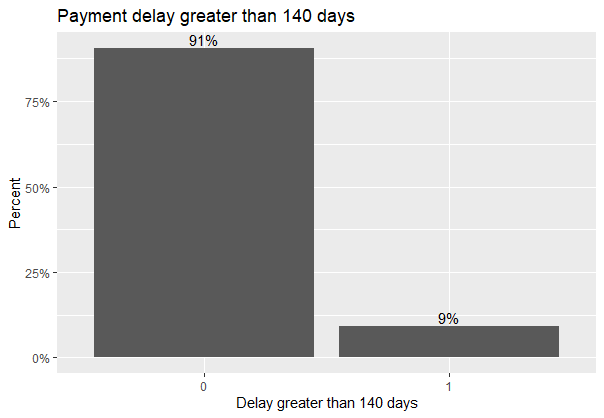

Main topic of this data science project is to optimize the collection process. Sponsor of the project is Mr. Jiří Procházka, who decided on the scope of the project, provided data and helped define project deliverables.

First of all it was important to understand the collection process. Clients are paying certain amount due to the certain date. If the client delays his payment, certain collection procedure takes place because of the costs that rise for the company. There are three actions taking place under different conditions. If the payment is delayed for 21 - 69 days, first action is taken. Second action is taken if the delay is between 70 - 139 days and the third action is taken for delay greater than 140 days.

Our goal was to create three models. First model predicts whether the customer will be delayed in payment for 21+ days. Second model predicts whether the customer will be delayed in payment for 140+ days. Lastly, third model should estimate average number of days delayed if the client would exceed the first action. All three models were defined the baseline accuracy.

As one of the deliverables, the project documentation describes project flow. Project consisted of three major steps: Data preparation, Modeling, Evaluation. All of the phases are described in detail with visualized results and findings later in this document.

We chose to use R studio to prepare the date, create models and evaluate and RMarkdown was used to create documentation of the project.

```{r setup, include=FALSE}
knitr::opts_chunk$set(echo = FALSE, fig.width = 12, fig.height = 8)
library(tidyverse)
library(naniar)
library(styler)
library(GGally)
library(skimr)
library(ggcorrplot)
library(gridExtra)
```

```{r load, eval=TRUE, include=FALSE, cache=TRUE}
data_collection <- read.csv("..\\payment_dates_final.csv")
data_collection <- data_collection %>%
  mutate(due_date = as.Date(due_date, format = "%Y-%m-%d"))
data_collection <- data_collection %>%
  mutate(payment_date = as.Date(payment_date, format = "%Y-%m-%d"))
data_collection <- data_collection %>%
  mutate(product_type = as.factor(product_type))
data_collection <- data_collection %>%
  mutate(contract_status = as.factor(contract_status))
data_collection <- data_collection %>%
  mutate(business_discount = as.factor(business_discount))
data_collection <- data_collection %>%
  mutate(gender = as.factor(gender))
data_collection <- data_collection %>%
  mutate(marital_status = as.factor(marital_status))
data_collection <- data_collection %>%
  mutate(clients_phone = as.factor(clients_phone))
data_collection <- data_collection %>%
  mutate(client_mobile = as.factor(client_mobile))
data_collection <- data_collection %>%
  mutate(client_email = as.factor(client_email))
data_collection <- data_collection %>%
  mutate(total_earnings = factor(total_earnings, labels = c(
    "level1", "level2", "level3", "level4",
    "level5", "level6", "level7", "level8",
    "level9", "level10", "not_declared"
  )))
data_collection <- data_collection %>%
  mutate(living_area = as.factor(living_area))
data_collection <- data_collection %>%
  mutate(different_contact_area = as.factor(different_contact_area))
data_collection <- data_collection %>%
  mutate(kc_flag = as.factor(kc_flag))
data_collection <- data_collection %>%
  mutate(cf_val = as.numeric(cf_val))
data_collection <- data_collection %>%
  mutate(kzmz_flag = as.factor(kzmz_flag))
data_collection <- data_collection %>%
  mutate(due_amount = as.numeric(due_amount))
data_collection <- data_collection %>%
  mutate(paid_amount = as.numeric(payed_ammount))
data_collection <- subset(data_collection, select = -payed_ammount)
data_collection$delay <- difftime(data_collection$payment_date,
  data_collection$due_date, tz,
  units = "days"
)
```
# Data Preparation
## Data Understanding
### Data Description Report

The initial data was provided in a comma-separated values file, and was loaded and processed using the R programming language. Dataset used in this analysis contains 2 353 012 observations and 24 variables. Out of the 24 variables, 13 are of factor datatype, 9 are numeric and 2 are dates.
All columns from the initial data were converted to the correct datype according to the data description file, which was provided. Column payed_ammount was replaced by column paid_amount. Column payment_date originally contained some blank fields, which were subsequently filled in as NA.

|Column name|Description|Type|Values|
|-----------|-----------|-----------|
|contract_id|Unique identificator of the contract|Int|\{1,2,3,…,N}|
|payment_order|Order of the payment|Int|{1,2,3,…}|
|due_date|Payment deadline|Date|YY/MM/DD|
|payment_date|Date of the payment|Date|YY/MM/DD|
|product_type|Type of the product|Factor|{1,2,3,4,5}|
|contract_status|Contract status|Factor|{1,2,3,4,5,6,7,8,9}|
|business_discount|Business discount provided|Factor|{0,1}|
|gender|Gender|Factor|{1,2}|
|marital_status|Marital status|Factor|{1,2,3,4,5,6}|
|number_of_children|Number of children|Int|{1,2,3,…}|
|number_other_product|Number of other products|Int|{1,2,3,…}|
|clients_phone|T/F if the client filled in home phone|Factor|{True, False}|
|client_mobile|T/F if the client filled in mobile phone|Factor|{True, False}|
|client_email|T/F if the client filled in email address|Factor|{True, False}|
|total_earnings|Earning bucket|Factor|{level1,…, not_declared}|
|birth_year|Birth year of the client|Int|{1990,1991,...}|
|birth_month|Birth month of the client|Int|{1,2,3,…}|
|living_area|Region of the client home address|Factor|{1,2,3,…}|
|different_contact_area|T/F if the client filled different home and contact address|Factor|{True, False}|
|kc_flag|T/F if the client does not home local citizenship|Factor|{True, False}|
|cf_val|If the special measure during the underwriting was applied|||
|kzmz_flag|T/F if the client filled in employer|Factor|{True, False}|
|due_amount|Installment what should be payed|Numeric|(0,…)|
|payed_amount|What was payed at a certain date|Numeric|(0,…)|

### Value ranges
Frequency, relative frequency and relative cumulative frequency were computed for each category in all categorical variables. All frequency tables can be located in the "frequencies" list.

### Attribute correlations

```{r correlogram, eval=FALSE, echo=FALSE, fig.cap="\\label{fig:correlogram}Correlation plot"}
correlogram <- data_collection %>%
  drop_na() %>%
  select_if(is.numeric) %>%
  cor %>%
  ggcorrplot(
    p.mat = p.mat,
    type = "lower", hc.order = T, ggtheme = theme_minimal,
    colors = c("#6D9EC1", "white", "#E46726"),
    show.diag = T, lab_size = 5, title = "Correlation Matrix",
    legend.title = "Correlation Value",
    outline.color = "white" 
  )
print(correlogram)
```

We computed correlation coefficients between all possible pairs of numeric variables, see Figure \@ref(fig:correlogram), and discovered strong positive correlation between due amount and paid amount. This could be due to the fact that in the event that the installment has already been paid, the due amount and the paid amount would assume the same value. Correlation between the remaining pairs of numeric variables was either nonexistent or negligible.
Then, the significance of correlation between due amount and paid amount was tested using Pearson's product moment correlation coefficient. The pair of attributes was found to be significantly correlated with a correlation coefficient  of 0.76 and p-value less than 2.2e-16.

Relationship between categorical variables was tested using chi-squared test with the significance level of 0.05. All significantly correlated pairs of variables can be accessed in "categorical_rel" dataframe.

#### Basic statistics
Basic statistics computed for numeric variables can be located in Table \@ref{tab:statistics}. Distribution of numeric and categorical variables was visualized using boxplots, density plots and histograms, see in Attachments, Figure \@ref(fig:boxplots) and Figure \@ref(fig:density).

```{r statistics, echo=FALSE, results='asis', tab.cap="\\label{tab:statistics}Statistics summary."}
# Summary for each attribute
headofTable <- c(
  "Num. of Children", "Num. Other Product", "Year of Birth",
  "Due amount", "Paid amount", "Delay"
)
EX <- c(
  mean(data_collection$number_of_children),
  mean(data_collection$number_other_product), mean(data_collection$birth_year),
  mean(data_collection$due_amount), mean(data_collection$paid_amount),
  mean(data_collection$delay)
)
VarX <- c(
  var(data_collection$number_of_children),
  var(data_collection$number_other_product), var(data_collection$birth_year),
  var(data_collection$due_amount), var(data_collection$paid_amount),
  var(data_collection$delay)
)
Median <- c(
  median(data_collection$number_of_children),
  median(data_collection$number_other_product),
  median(data_collection$birth_year), median(data_collection$due_amount),
  median(data_collection$paid_amount), median(data_collection$delay)
)
Q1 <- c(
  quantile(data_collection$number_of_children, probs = 1 / 4, na.rm = TRUE),
  quantile(data_collection$number_other_product, probs = 1 / 4, na.rm = TRUE),
  quantile(data_collection$birth_year, probs = 1 / 4, na.rm = TRUE),
  quantile(data_collection$due_amount, probs = 1 / 4, na.rm = TRUE),
  quantile(data_collection$paid_amount, probs = 1 / 4, na.rm = TRUE),
  quantile(data_collection$delay, probs = 1 / 4, na.rm = TRUE)
)
Q3 <- c(
  quantile(data_collection$number_of_children, probs = c(3 / 4), na.rm = TRUE),
  quantile(data_collection$number_other_product, probs = c(3 / 4), na.rm = TRUE),
  quantile(data_collection$birth_year, probs = c(3 / 4), na.rm = TRUE),
  quantile(data_collection$due_amount, probs = c(3 / 4), na.rm = TRUE),
  quantile(data_collection$paid_amount, probs = c(3 / 4), na.rm = TRUE),
  quantile(data_collection$delay, probs = 3 / 4, na.rm = TRUE)
)
Min <- c(
  min(data_collection$number_of_children),
  min(data_collection$number_other_product),
  min(data_collection$birth_year), min(data_collection$due_amount),
  min(data_collection$paid_amount), min(data_collection$delay)
)
Max <- c(
  max(data_collection$number_of_children),
  max(data_collection$number_other_product), max(data_collection$birth_year),
  max(data_collection$due_amount), max(data_collection$paid_amount),
  max(data_collection$delay)
)
summaryData <- distinct(data.frame(headofTable, EX, VarX, Median, Q1, Q3, Min,
  Max,
  check.rows = FALSE, check.names = FALSE
))
summaryData
```

## Data Exploration Report
NIECO HODIT


## Data Quality Report
### Data coverage
Next step consited of the data coverage analysis. As an example, we have chosen a couple of plots, that indicate interesting data distribution. 
We for example found out, that clients mostly order the product type 1, contracts are mostly in status number 1 or that most of the payments have a discount.
We also discovered, that the marital status of the clients is mostly number 3 and they have most frequently no children. Clients also very frequently do not provide information about their earnings and they ordered usually 1 other product.

All the mentioned findings can be seen on visualizations on Figure \@ref(fig:distribution). All the data coverage visualizations are available in the Attachments.

```{r distribution, echo=FALSE, warning=FALSE, message=FALSE, eval=TRUE}
distribution_plots <- list()
distribution_plots[[1]] <- data_collection %>%
  drop_na() %>%
  ggplot(aes(number_of_children)) +
  geom_bar(fill = "grey70") +
  geom_vline(
    xintercept = mean(data_collection$number_of_children),
    color = "blue", linetype = "dotted", size = 1
  ) +
  geom_vline(
    xintercept = median(data_collection$number_of_children),
    color = "red", linetype = "dotted", size = 1
  ) +
  labs(
    title = "Distribution of number_of_children",
    x = "Number of children",
    y = "Count"
  ) +
  scale_x_continuous(breaks = seq(from = 0, to = 10, by = 1)) +
  annotate(
    geom = "text", x = mean(data_collection$number_of_children),
    y = 500000, label = "mean", color = "blue"
  ) +
  annotate(
    geom = "text", x = median(data_collection$number_of_children),
    y = 1000000, label = "median", color = "red"
  ) +
  theme_minimal()

distribution_plots[[2]] <- data_collection %>%
  drop_na() %>%
  ggplot(aes(number_other_product)) +
  geom_bar(fill = "grey70") +
  geom_vline(
    xintercept = mean(data_collection$number_other_product),
    color = "blue", linetype = "dotted", size = 1
  ) +
  geom_vline(
    xintercept = median(data_collection$number_other_product),
    color = "red", linetype = "dotted", size = 1
  ) +
  labs(
    title = "Distribution of number_other_product",
    x = "Number other products",
    y = "Count"
  ) +
  scale_x_continuous(breaks = seq(from = 1, to = 13, by = 1)) +
  annotate(
    geom = "text", x = mean(data_collection$number_other_product),
    y = 250000, label = "mean", color = "blue"
  ) +
  annotate(
    geom = "text", x = median(data_collection$number_other_product),
    y = 600000, label = "median", color = "red"
  ) +
  theme_minimal()

distribution_plots[[3]] <- data_collection %>%
  drop_na() %>%
  ggplot(aes(product_type)) +
  geom_bar(fill = "grey70") +
  labs(
    title = "Distribution of product_type",
    x = "Product type",
    y = "Count"
  ) +
  theme_minimal()

distribution_plots[[4]] <- data_collection %>%
  drop_na() %>%
  ggplot(aes(business_discount)) +
  geom_bar(fill = "grey70") +
  labs(
    title = "Distribution of business_discount",
    x = "Business discount",
    y = "Count"
  ) +
  theme_minimal()

distribution_plots[[5]] <- data_collection %>%
  drop_na() %>%
  ggplot(aes(total_earnings)) +
  geom_bar(fill = "grey70") +
  labs(
    title = "Distribution of total_earnings",
    x = "Total earnings",
    y = "Count"
  ) +
  theme_minimal()

distribution_plots[[6]] <- data_collection %>%
  drop_na() %>%
  ggplot(aes(product_type)) +
  geom_bar(fill = "grey70") +
  labs(
    title = "Distribution of product_type",
    x = "Product type",
    y = "Count"
  ) +
  theme_minimal()

distribution_plots[[7]] <- data_collection %>%
  drop_na() %>%
  ggplot(aes(contract_status)) +
  geom_bar(fill = "grey70") +
  labs(
    title = "Distribution of contract_status",
    x = "Contract status",
    y = "Count"
  ) +
  theme_minimal()

distribution_plots <- grid.arrange(grobs = distribution_plots, ncol = 2)

```


### Missing values
Exploring the NA values in the dataset, we found out, that 4 attributes had 
almost same percentage of missing values, as can be seen on the statistics on Figure \@ref(fig:Missing_stat). 
Attributes kc_flag, living_area, cf_val and different_contact_area have the most missing values, almost 20 %, whereas payment_order has around 3,5 % and payment_date and delay have the same percentage, almost 0,5 %.

Using a different visualization, that can be seen on Figure \@ref(fig:Missing_complex), 
we discovered, that the four attributes with the highest percentage are 
not missing at random but almost all at the same time.

We found out, that contract_id together with payment_order were not creating a unique key of the data payment, 
but one payment was divided into multiple parts, which was also causing problem with NA values in the four attributes. Data in the four attributes were not copied into other parts of a payment, but were present in just the first payment part. 
We decided to unify the payment parts into only one payment by summarizing the 
paid amount of all the parts and using the payment_date of the last paid part. 
Thanks to the unification, the amount of NA values has markedly decreased. 

Secondly, we dealt with the NA values in payment_order and payment_date.
Since it was only less then 4 % of the dataset, and it was not possible to
substitute the values, we decided to delete the rows.

```{r Missing_stat, echo=FALSE, warning=FALSE, message=FALSE, fig.cap="\\label{fig:Missing_stat}Basic statistics of the NA values in the data."}
variables_miss <- miss_var_summary(data_collection)
print(variables_miss)
```

```{r Missing_complex, echo=FALSE, warning=FALSE, message=FALSE, fig.cap="\\label{fig:Missing_complex}Distribution of missing values"}
gg_miss_upset(data_collection)
```


## Feature engineering

```{r load_new_data, eval=TRUE, include=FALSE, cache=TRUE}
data_prepared <- read.delim("..\\data_collection_prepared_new.txt", header = TRUE, sep = ";", dec = ".")

data_prepared <- data_prepared %>%
  mutate(delay_140_y = as.factor(delay_140_y))
data_prepared <- data_prepared %>%
  mutate(delay_21_y = as.factor(delay_21_y))
```

We decided to add new features to create higher-accuracy models.
First of all, we computed a numerical feature "delay" counting the difference between payment_date and due_date. 

Since we are creating two classification models deciding whether a new payment will be delayed
for more than 21 days or more than 140 days, we created 2 new binary features "delay_21_y" and "delay_140_y".

We also created a new numerical feature "delay_indiv" counting the mean delay for the whole client´s history. We also computed 2 new numerical features, "delay_indiv_21" and "delay_indiv_140" counting cumulative number of delayed payments (21, 140 days) by one contract

Lastly, numerical features "mean_delay_1m" ,"mean_delay_3m", "mean_delay_6m", "mean_delay_12m" are computing the mean delay for 1/3/6/12 months for each contract.

## Exploratory analysis of the new features
### Data description report
|Column name|Description|Type|Values|
|-----------|-----------|-----------|
|delay|Difference between payment_date and due_date|Int|"{-N,...,N}|
|delay_21_y|T/F if the delay is more than 21 days|Factor|{True, False}|
|delay_140_y|T/F if the delay is more than 140 days|Int|Factor|{True, False}|
|delay_indiv|Mean delay for the whole client's history|Int|{-N,...,N}|
|delay_indiv_21|Cumulative sum of payments delayed for more than 21 days by contract|Int|{1,2,3,…,N}|
|delay_indiv_140|Cumulative sum of the payments delayed for more than 140 days by contract |Int|{1,2,3,…,N}|
|mean_delay_1m|Average payment delay for the last month|Int|{-N,...,N}|
|mean_delay_3m|Average payment delay for the last 3 months|Int|{-N,...,N}|
|mean_delay_6m|Average payment delay for the last 6 months|Int|{-N,...,N}|
|mean_delay_12m|Average payment delay for the last 12 months|Int|{-N,...,N}|

### Basic statistics
We computed basic statistics for each new attribute.
All the visualizations can be seen on \@ref(fig:stat_new_delay).

```{r help, echo=FALSE, warning=FALSE, message=FALSE, eval = TRUE}

histPercent <- function(x, ...) {
  H <- hist(data_prepared$delay, plot = FALSE)
  H$density <- with(H, 100 * density * diff(breaks)[1])
  labs <- paste(round(H$density), "%", sep="")
  plot(H, freq = FALSE, labels = labs, ylim=c(0, 1.08*max(H$density)),...)
}
```

First of all we focused on attribute delay. Since it is probably the most important attribute of the nexly created, we analysed its distribution, distribution of delay on log scale DOPLNIT CO SME NASLI.
```{r stat_new_delay, echo=FALSE, warning=FALSE, eval= TRUE, message=FALSE, fig.cap="\\label{fig:stat_new_delay}Basic statistics of the added attribute delay."}
delay_plots <- list()
 
delay_plots[[1]] <- data_prepared %>%
  drop_na() %>%
  ggplot(aes(x = delay)) + 
  geom_histogram() + 
  xlim(-2000, 3000) +
  labs(
    title = "Distribution of delay",
    x = "Delay",
    y = "Count"
  ) +
  theme_minimal()

delay_plots[[2]] <- histPercent(pdata$y, col="gray", xlab="Delay in days", main="Distribution of delay", xaxp = c(-2000,3000,10))

delay_plots[[3]] <-  data_prepared %>%
  drop_na() %>%
  ggplot(aes(x = delay)) + 
  geom_histogram() + 
  scale_y_log10() + 
  xlim(-2000, 3000) +
  labs(
    title = "Distribution of delay on logarithmic scale",
    x = "Delay",
    y = "Count"
  ) +
  theme_minimal()

delay_plots[[4]] <- data_prepared %>%
  drop_na() %>%
  ggplot(aes(delay)) +
  geom_density() +
  geom_vline(
    xintercept = mean(data_prepared$delay, na.rm = TRUE),
    color = "blue",
    linetype = "dotted", size = 1
  ) +
  geom_vline(
    xintercept = median(data_prepared$delay, na.rm = TRUE),
    color = "red",
    linetype = "dotted", size = 1
  ) +
  labs(
    title = "Distribution of delay",
    x = "Delay",
    y = "Count"
  ) +
  annotate(
    geom = "text", x = mean(data_prepared$delay, na.rm = TRUE),
    y = 0.04, label = "mean", color = "blue"
  ) +
  annotate(
    geom = "text", x = median(data_prepared$delay, na.rm = TRUE),
    y = 0.02, label = "median", color = "red"
  ) +
  theme_minimal()

delay_plots
```

We also computed some basic statistics for the other added attributes. DOPLNIT CO SME NASLI
```{r stat_new, echo=FALSE, warning=FALSE, message=FALSE, fig.cap="\\label{fig:stat_new}Basic statistics of the added attributes.."}
statistics_plots <- list()

statistics_plots[[1]] <-
data_prepared %>%
  drop_na() %>%
  ggplot(aes(delay_indiv)) +
  geom_density() +
  labs(
    title = "Distribution of delay_indiv UPRAVENA OS, NECHAME TAKTO??",
    x = "Delay_indiv",
    y = "Count"
  ) +
  xlim(-500, 500) +
  theme_minimal()

statistics_plots[[2]] <-
data_prepared %>%
  drop_na() %>%
  ggplot(aes(mean_delay_1m)) +
  geom_density() +
  labs(
    title = "1 m mean delay distribution",
    x = "Mean delay 1 month",
    y = "Count"
  ) +
  theme_minimal()

statistics_plots[[3]] <-
data_prepared %>%
  drop_na() %>%
  ggplot(aes(mean_delay_3m)) +
  geom_density() +
  labs(
    title = "3 m mean delay distribution",
    x = "Mean delay 3 months",
    y = "Count"
  ) +
  theme_minimal()

statistics_plots[[4]] <-
data_prepared %>%
  drop_na() %>%
  ggplot(aes(mean_delay_6m)) +
  geom_density() +
  labs(
    title = "6 m mean delay distribution",
    x = "Mean delay 6 months",
    y = "Count"
  ) +
  theme_minimal()


statistics_plots[[5]] <-
data_prepared %>%
  drop_na() %>%
  ggplot(aes(mean_delay_12m)) +
  geom_density() +
  labs(
    title = "12 m mean delay distribution",
    x = "Mean delay 12 months",
    y = "Count"
  ) +
  theme_minimal()

statistics_plots[[6]] <-
ggplot(data = data_prepared, aes(x = delay_indiv_21)) +
  geom_bar() +
  theme_minimal()

statistics_plots[[7]] <-
ggplot(data = data_prepared, aes(x = delay_indiv_140)) +
  geom_bar() +
  theme_minimal()

statistics_plots <- grid.arrange(grobs = statistics_plots, ncol = 2)

```


```{r help_new, echo=FALSE, warning=FALSE, message=FALSE, eval=FALSE}

statistics_plots[[8]] <-
ggplot(data = data_prepared, aes(x = delay_21_y)) +
  geom_bar(aes(y = (..count..)/sum(..count..)))  + scale_y_continuous(labels=scales::percent) +
  geom_text(aes(y = ((..count..)/sum(..count..)), label = scales::percent((..count..)/sum(..count..))), stat = "Count", vjust = -0.25) +
  labs(title = "Payment delay greater than 21 days", y = "Percent", x = "Delay greater than 21 days")

statistics_plots[[9]] <-
ggplot(data = data_prepared, aes(x = delay_140_y)) +
  geom_bar(aes(y = (..count..)/sum(..count..)))  + scale_y_continuous(labels=scales::percent) +
  geom_text(aes(y = ((..count..)/sum(..count..)), label = scales::percent((..count..)/sum(..count..))), stat = "Count", vjust = -0.25) +
  labs(title = "Payment delay greater than 140 days", y = "Percent", x = "Delay greater than 140 days")

```


### Missing values
As can be seen on Figure, newly-created features also contain NA values. The highest percentage of missing values has attribute mean_delay_12m, almost 55 %. Together with mean_delay_6m, mean_delay_3m and mean_delay_1m, they are the only new attributes holding NA attributes. 

It is not surprising, that these attributes have the highest percentage of NAs, since they compute results only every 12/6/3/1 months.

We decided to replace the NA values by 0, so they can be later used in the modeling part.
```{r miss_stat_new, echo=FALSE, warning=FALSE, message=FALSE, fig.cap="\\label{fig:Missing_stat_new}Basic statistics of the NA values in the preprocessed data."}
variables_miss_new <- miss_var_summary(data_prepared)
print(variables_miss_new)
```

## Advanced statistics


 


# Modeling

Predict if the customer will be delayed in payment for 21+ days.

Significantly better than random model AUC > 0.7. In case of highly unbalanced other metrics such as AUCPR etc.


Predict if the customer will be delayed in payment for 140+ days.

Significantly better than random model AUC > 0.7. In case of highly unbalanced other metrics such as AUCPR etc.


Estimate average number of days delayed if the client would exceed the first action. 

Better than simple average model by at least 30%.

## Prediction model (21+ days) 
## Prediction model (140+ days) 
## Estimation of the expected number of days of delay when the client triggers first action 
# Conclusion
# Discussion

# Attachments

```{r density, echo=FALSE, warning=FALSE, message=FALSE, fig.cap="\\label{fig:density}Density plots."}
density_plots <- list()
density_plots[[1]] <- data_collection %>%
  drop_na() %>%
  ggplot() +
  geom_bar(aes(contract_id), fill = "grey70") +
  geom_vline(
    xintercept = mean(data_collection$contract_id),
    color = "blue", linetype = "dotted", size = 1
  ) +
  geom_vline(
    xintercept = median(data_collection$contract_id),
    color = "red", linetype = "dotted", size = 1
  ) +
  labs(
    title = "Distribution of contract_id",
    x = "Contract ID",
    y = "Count"
  ) +
  annotate(
    geom = "text", x = mean(data_collection$contract_id),
    y = 25, label = "mean", color = "blue"
  ) +
  annotate(
    geom = "text", x = median(data_collection$contract_id),
    y = 75, label = "median", color = "red"
  ) +
  theme_minimal()

density_plots[[2]] <- data_collection %>%
  drop_na() %>%
  ggplot(aes(payment_order)) +
  geom_density() +
  geom_vline(
    xintercept = mean(data_collection$payment_order, na.rm = TRUE),
    color = "blue", linetype = "dotted", size = 1
  ) +
  geom_vline(
    xintercept = median(data_collection$payment_order, na.rm = T),
    color = "red", linetype = "dotted", size = 1
  ) +
  labs(
    title = "Distribution of payment_order",
    x = "Payment order",
    y = "Count"
  ) +
  annotate(
    geom = "text", x = mean(data_collection$payment_order, na.rm = T),
    y = 0.01, label = "mean", color = "blue"
  ) +
  annotate(
    geom = "text", x = median(data_collection$payment_order, na.rm = T),
    y = 0.03, label = "median", color = "red"
  ) +
  theme_minimal()

density_plots[[3]] <- data_collection %>%
  drop_na() %>%
  ggplot(aes(number_of_children)) +
  geom_bar(fill = "grey70") +
  geom_vline(
    xintercept = mean(data_collection$number_of_children),
    color = "blue", linetype = "dotted", size = 1
  ) +
  geom_vline(
    xintercept = median(data_collection$number_of_children),
    color = "red", linetype = "dotted", size = 1
  ) +
  labs(
    title = "Distribution of number_of_children",
    x = "Number of children",
    y = "Count"
  ) +
  scale_x_continuous(breaks = seq(from = 0, to = 10, by = 1)) +
  annotate(
    geom = "text", x = mean(data_collection$number_of_children),
    y = 500000, label = "mean", color = "blue"
  ) +
  annotate(
    geom = "text", x = median(data_collection$number_of_children),
    y = 1000000, label = "median", color = "red"
  ) +
  theme_minimal()

density_plots[[4]] <- data_collection %>%
  drop_na() %>%
  ggplot(aes(number_other_product)) +
  geom_bar(fill = "grey70") +
  geom_vline(
    xintercept = mean(data_collection$number_other_product),
    color = "blue", linetype = "dotted", size = 1
  ) +
  geom_vline(
    xintercept = median(data_collection$number_other_product),
    color = "red", linetype = "dotted", size = 1
  ) +
  labs(
    title = "Distribution of number_other_product",
    x = "Number other products",
    y = "Count"
  ) +
  scale_x_continuous(breaks = seq(from = 1, to = 13, by = 1)) +
  annotate(
    geom = "text", x = mean(data_collection$number_other_product),
    y = 250000, label = "mean", color = "blue"
  ) +
  annotate(
    geom = "text", x = median(data_collection$number_other_product),
    y = 600000, label = "median", color = "red"
  ) +
  theme_minimal()

density_plots[[5]] <- data_collection %>%
  drop_na() %>%
  ggplot(aes(birth_year)) +
  geom_bar(fill = "grey70") +
  geom_vline(
    xintercept = mean(data_collection$birth_year), color = "blue",
    linetype = "dotted", size = 1
  ) +
  labs(
    title = "Distribution of birth_year",
    x = "Birth year",
    y = "Count"
  ) +
  scale_x_discrete(breaks = seq(from = 1920, to = 2000, by = 10)) +
  annotate(
    geom = "text", x = mean(data_collection$birth_year),
    y = 20000, label = "mean = median", color = "blue"
  ) +
  theme_minimal()

density_plots[[6]] <- data_collection %>%
  drop_na() %>%
  ggplot(aes(birth_month)) +
  geom_bar(fill = "grey70") +
  geom_vline(
    xintercept = mean(data_collection$birth_month), color = "blue",
    linetype = "dotted", size = 1
  ) +
  geom_vline(
    xintercept = median(data_collection$birth_month), color = "red",
    linetype = "dotted", size = 1
  ) +
  labs(
    title = "Distribution of birth_month",
    x = "Birth month",
    y = "Count"
  ) +
  scale_x_discrete(breaks = seq(from = 1, to = 12, by = 1)) +
  annotate(
    geom = "text", x = mean(data_collection$birth_month),
    y = 100000, label = "mean", color = "blue"
  ) +
  annotate(
    geom = "text", x = median(data_collection$birth_month),
    y = 50000, label = "median", color = "red"
  ) +
  theme_minimal()

density_plots[[7]] <- data_collection %>%
  drop_na() %>%
  ggplot(aes(cf_val)) +
  geom_density() +
  geom_vline(
    xintercept = mean(data_collection$cf_val, na.rm = TRUE), color = "blue",
    linetype = "dotted", size = 1
  ) +
  labs(
    title = "Distribution of cf_val",
    x = "CF value",
    y = "Count"
  ) +
  annotate(
    geom = "text", x = median(data_collection$cf_val, na.rm = TRUE),
    y = 1, label = "median = mean", color = "red"
  ) +
  theme_minimal()

density_plots[[8]] <- data_collection %>%
  drop_na() %>%
  ggplot(aes(due_amount)) +
  geom_density() +
  geom_vline(
    xintercept = mean(data_collection$due_amount), color = "blue",
    linetype = "dotted", size = 1
  ) +
  geom_vline(
    xintercept = median(data_collection$due_amount), color = "red",
    linetype = "dotted", size = 1
  ) +
  labs(
    title = "Distribution of due_amount",
    x = "Due amount",
    y = "Count"
  ) +
  annotate(
    geom = "text", x = mean(data_collection$due_amount),
    y = 0.0001, label = "mean", color = "blue"
  ) +
  annotate(
    geom = "text", x = median(data_collection$due_amount),
    y = 0.0003, label = "median", color = "red"
  ) +
  theme_minimal()

density_plots[[9]] <- data_collection %>%
  drop_na() %>%
  ggplot(aes(paid_amount)) +
  geom_density() +
  geom_vline(
    xintercept = mean(data_collection$paid_amount), color = "blue",
    linetype = "dotted", size = 1
  ) +
  geom_vline(
    xintercept = median(data_collection$paid_amount), color = "red",
    linetype = "dotted", size = 1
  ) +
  labs(
    title = "Distribution of paid amount",
    x = "Paid amount",
    y = "Count"
  ) +
  annotate(
    geom = "text", x = mean(data_collection$paid_amount),
    y = 0.0002, label = "mean", color = "blue"
  ) +
  annotate(
    geom = "text", x = median(data_collection$paid_amount),
    y = 0.0004, label = "median", color = "red"
  ) +
  theme_minimal()

density_plots[[10]] <- data_collection %>%
  drop_na() %>%
  ggplot(aes(delay)) +
  geom_density() +
  geom_vline(
    xintercept = mean(data_collection$delay, na.rm = TRUE),
    color = "blue",
    linetype = "dotted", size = 1
  ) +
  geom_vline(
    xintercept = median(data_collection$delay, na.rm = TRUE),
    color = "red",
    linetype = "dotted", size = 1
  ) +
  labs(
    title = "Distribution of delay",
    x = "Delay",
    y = "Count"
  ) +
  annotate(
    geom = "text", x = mean(data_collection$delay, na.rm = TRUE),
    y = 0.04, label = "mean", color = "blue"
  ) +
  annotate(
    geom = "text", x = median(data_collection$delay, na.rm = TRUE),
    y = 0.02, label = "median", color = "red"
  ) +
  theme_minimal()

density_plots[[11]] <- data_collection %>%
  drop_na() %>%
  ggplot(aes(due_date)) +
  geom_density() +
  geom_vline(
    xintercept = mean(data_collection$due_date),
    color = "blue", linetype = "dotted", size = 1
  ) +
  geom_vline(
    xintercept = median(data_collection$due_date),
    color = "red", linetype = "dotted", size = 1
  ) +
  labs(
    title = "Distribution of due_date",
    x = "Due date",
    y = "Count"
  ) +
  scale_x_date(date_labels = "%Y") +
  annotate(
    geom = "text", x = mean(data_collection$due_date),
    y = 0.0003, label = "mean", color = "blue"
  ) +
  annotate(
    geom = "text", x = median(data_collection$due_date),
    y = 0.0006, label = "median", color = "red"
  ) +
  theme_minimal()

density_plots[[12]] <- data_collection %>%
  drop_na() %>%
  ggplot(aes(payment_date)) +
  geom_density() +
  geom_vline(
    xintercept = mean(data_collection$payment_date, na.rm = T),
    color = "blue", linetype = "dotted", size = 1
  ) +
  geom_vline(
    xintercept = median(data_collection$payment_date, na.rm = T),
    color = "red", linetype = "dotted", size = 1
  ) +
  labs(
    title = "Distribution of payment_date",
    x = "Payment date",
    y = "Count"
  ) +
  scale_x_date(date_labels = "%Y") +
  annotate(
    geom = "text", x = mean(data_collection$payment_date, na.rm = T),
    y = 0.0006, label = "mean", color = "blue"
  ) +
  annotate(
    geom = "text", x = median(data_collection$payment_date, na.rm = T),
    y = 0.0003, label = "median", color = "red"
  ) +
  theme_minimal()
density_plots <- grid.arrange(grobs = density_plots, ncol = 2)
```

```{r boxplots, echo=FALSE, warning=FALSE, message=FALSE, fig.cap="\\label{fig:boxplots}Boxplots for numeric attributes."}
boxplots <- list()
boxplots[[1]] <- data_collection %>%
  drop_na() %>%
  ggplot() +
  geom_boxplot(aes(y = number_of_children)) +
  scale_x_discrete() +
  labs(title = "Number of children")

boxplots[[2]] <- data_collection %>%
  drop_na() %>%
  ggplot() +
  geom_boxplot(aes(y = number_other_product)) +
  scale_x_discrete() +
  labs(title = "Number other product")

boxplots[[3]] <- data_collection %>%
  drop_na() %>%
  ggplot() +
  geom_boxplot(aes(y = birth_year)) +
  scale_x_discrete() +
  labs(title = "Birth year")

boxplots[[4]] <- data_collection %>%
  drop_na() %>%
  ggplot() +
  geom_boxplot(aes(y = birth_month)) +
  scale_x_discrete() +
  labs(title = "Birth month")

boxplots[[5]] <- data_collection %>%
  drop_na() %>%
  ggplot() +
  geom_boxplot(aes(y = cf_val)) +
  scale_x_discrete() +
  labs(title = "CF value")

boxplots[[6]] <- data_collection %>%
  drop_na() %>%
  ggplot() +
  geom_boxplot(aes(y = due_amount)) +
  labs(title = "Due amount")

boxplots[[7]] <- data_collection %>%
  drop_na() %>%
  ggplot() +
  geom_boxplot(aes(y = paid_amount)) +
  labs(title = "Paid amount")

boxplots[[8]] <- data_collection %>%
  drop_na() %>%
  ggplot() +
  geom_boxplot(aes(y = delay)) +
  scale_x_discrete() +
  labs(title = "Delay")

boxplots <- grid.arrange(grobs = boxplots, ncol = 4)
```

```{r coverage, echo=FALSE, eval=FALSE, warning=FALSE, message=FALSE, fig.cap="\\label{fig:coverage}Distribution of categorical attributes"}
coverage <- list()
coverage[[1]] <- ggplot(data = data_collection, aes(x = product_type)) +
  geom_bar() +
  theme(axis.text.x = element_text(angle = 0, hjust = 1))
coverage[[2]] <- ggplot(data = data_collection, aes(x = contract_status)) +
  geom_bar() +
  theme(axis.text.x = element_text(angle = 0, hjust = 1))
coverage[[3]] <- ggplot(data = data_collection, aes(x = business_discount)) +
  geom_bar() +
  theme(axis.text.x = element_text(angle = 0, hjust = 1))
coverage[[4]] <- ggplot(data = data_collection, aes(x = gender)) +
  geom_bar() +
  theme(axis.text.x = element_text(angle = 0, hjust = 1))
coverage[[5]] <- ggplot(data = data_collection, aes(x = marital_status)) +
  geom_bar() +
  theme(axis.text.x = element_text(angle = 0, hjust = 1))
coverage[[6]] <- ggplot(data = data_collection, aes(x = clients_phone)) +
  geom_bar() +
  theme(axis.text.x = element_text(angle = 0, hjust = 1))
coverage[[7]] <- ggplot(data = data_collection, aes(x = client_mobile)) +
  geom_bar() +
  theme(axis.text.x = element_text(angle = 0, hjust = 1))
coverage[[8]] <- ggplot(data = data_collection, aes(x = client_email)) +
  geom_bar() +
  theme(axis.text.x = element_text(angle = 0, hjust = 1))
coverage[[9]] <- ggplot(data = data_collection, aes(x = total_earnings)) +
  geom_bar() +
  theme_minimal() +
  theme(axis.text.x = element_text(angle = 0, hjust = 1)) +
  coord_flip()
coverage[[10]] <- data_collection %>%
  group_by(living_area) %>%
  summarize(frequency = n()) %>%
  arrange(desc(frequency)) %>%
  mutate(
    relative_frequency = frequency / sum(frequency),
    relative_frequency = round(100 * relative_frequency, 2)
    ) %>%
  head() %>%
  as.data.frame() %>%
  tableGrob(theme = ttheme_default(base_size = 8, padding = unit(c(2,2), "mm")))
coverage[[11]] <- ggplot(data = data_collection, aes(x = different_contact_area)) +
  geom_bar() +
  theme(axis.text.x = element_text(angle = 0, hjust = 1))
coverage[[12]] <- ggplot(data = data_collection, aes(x = kc_flag)) +
  geom_bar() +
  theme(axis.text.x = element_text(angle = 0, hjust = 1))
coverage[[13]] <- ggplot(data = data_collection, aes(x = kzmz_flag)) +
  geom_bar() +
  theme(axis.text.x = element_text(angle = 0, hjust = 1))
coverage <- grid.arrange(grobs = coverage, ncol = 3)
```